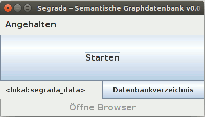

# Segrada starten

[Erste Schritte >>](tutorial01.md)

## Den Starter benutzer

Der Starter is eine einfache Möglichkeit, Segrada auf dem lokalen Rechner laufen zu lassen.

### Windows

* Laden Sie Segrada als ZIP-Datei von der Seite [www.segrada.org](http://segrada.org/fileadmin/downloads/Segrada.zip)
  herunter.
* Entpacken Sie die ZIP-Datei in einen beliebigen Ordner Ihrer Wahl.
* Öffnen Sie den Windows Explorer in diesem Ordner und starten Sie Segrada.exe, um den Starter zu öffnen. Falls der
  Starter **nicht** starten sollte, prüfen Sie bitte Ihre Java-Version und/oder laden sie Java von
  [Oracle](https://www.java.com/) herunter.
* Das Starterfenster sollte nun in ähnlicher Weise wie oben zu sehen sein.
* _Optional:_ Wählen Sie einen Pfad, in dem eine existierende Datenbank bereits gespeichert ist. Der Standardordner
  ist `segrada_data` im selben Verzeichnis wie die Programmdateien von Segrada.
* Klicken Sie auf "Start" im Starter-Fenster, um eine Datenbank zu erstellen. Dies wird beim ersten Mal eine Weile
  dauern.
* Es kann sein, dass der Windowsfirewall eine Warnung ausgibt. Diese können Sie mit "Ok" bestätigen.
* Öffnen Sie ihren Browser unter [http://localhost:8080/](http://localhost:8080/).

### Mac

* Laden Sie Segrada als TGZ-Datei von der Seite [www.segrada.org](http://segrada.org/fileadmin/downloads/Segrada.tgz)
  herunter.
* Entpacken Sie die TGZ-Datei in einen beliebigen Ordner Ihrer Wahl.
* Starten Sie das Kommando `start_mac.command` in dem gerade entpackten Ordner aus. Falls der
  Starter **nicht** starten sollte, prüfen Sie bitte Ihre Java-Version und/oder laden sie Java von
  [Oracle](https://www.java.com/) herunter.
* Das Starterfenster sollte nun in ähnlicher Weise wie oben zu sehen sein.
* _Optional:_ Wählen Sie einen Pfad, in dem eine existierende Datenbank bereits gespeichert ist (oder verwenden Sie
  einen leeren Ordner, um dort eine neue Datenbank zu erstellen). Der Standardordner ist `segrada_data` im selben
  Verzeichnis wie die Programmdateien von Segrada.
* Klicken Sie auf "Start" im Starter-Fenster, um eine Datenbank zu erstellen. Dies wird beim ersten Mal eine Weile
  dauern.
* Öffnen Sie ihren Browser unter [http://localhost:8080/](http://localhost:8080/).

### Linux, Unix

* Laden Sie Segrada als TGZ-Datei von der Seite [www.segrada.org](http://segrada.org/fileadmin/downloads/Segrada.tgz)
  herunter.
* Entpacken Sie die TGZ-Datei in einen beliebigen Ordner Ihrer Wahl.
* Öffnen Sie die Kommandozeile und führen Sie den Befehl `./start.sh` in dem gerade entpackten Ordner aus. Falls der
  Starter **nicht** starten sollte, prüfen Sie bitte Ihre Java-Version. Aus irgendeinem obskuren Grund muss auf
  Apple-Rechner das JDK installiert werden, um Java auszuführen. Besuchen Sie dazu die
  [Java-Seite von Oracle](http://www.oracle.com/technetwork/java/javase/downloads/index.html) und wählen Sie ein
  Installationspaket für Ihre Platform (z.B. Java SE Development Kit 8u66 für Mac 64-Bit).
* Das Starterfenster sollte nun in ähnlicher Weise wie oben zu sehen sein.
* _Optional:_ Wählen Sie einen Pfad, in dem eine existierende Datenbank bereits gespeichert ist (oder verwenden Sie
  einen leeren Ordner, um dort eine neue Datenbank zu erstellen). Der Standardordner ist `segrada_data` im selben
  Verzeichnis wie die Programmdateien von Segrada.
* Klicken Sie auf "Start" im Starter-Fenster, um eine Datenbank zu erstellen. Dies wird beim ersten Mal eine Weile
  dauern.
* Öffnen Sie ihren Browser unter [http://localhost:8080/](http://localhost:8080/).

## Segrada als Server starten

Um Segrada als eigenständigen Server zu starten, kann man die headless-Option verwenden:

    java -jar segrada-1.0-SNAPSHOT.jar headless

Mehr Optionen unter [Kommandozeilenoptionen](command_line_options.md). Zudem können Sie
[Segrada automatisch starten lassen](autostart.md).

## Segrada im Servlet-Kontext

Sie können Segrada als WAR in einem Servlet-Container starten. Diese Funktion ist bislang nicht besonders intensiv
getestet. Erfahrungen und Feedback sind daher erwünscht. 

Kompilieren Sie Segrada mit folgender Änderung: Ändern Sie das `packaging` Tag in der Datei pom.xml nach WAR.

[Erste Schritte >>](tutorial01.md)
