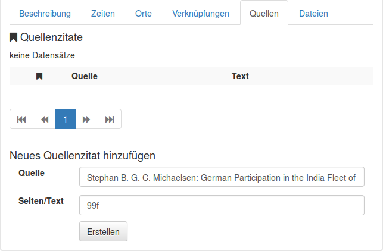
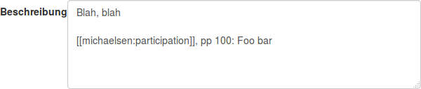
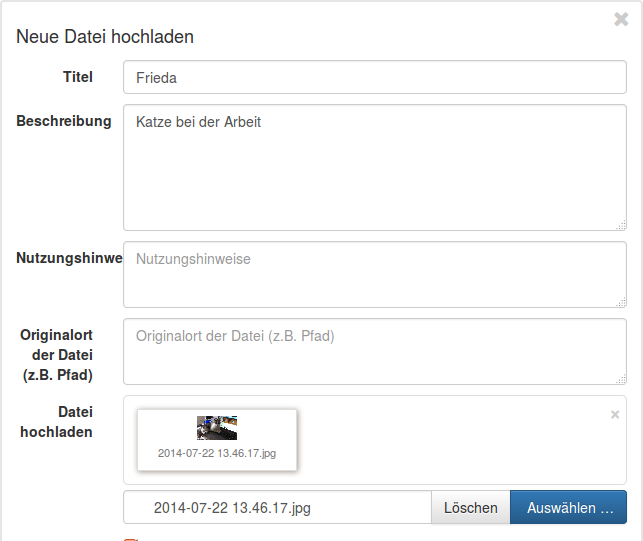
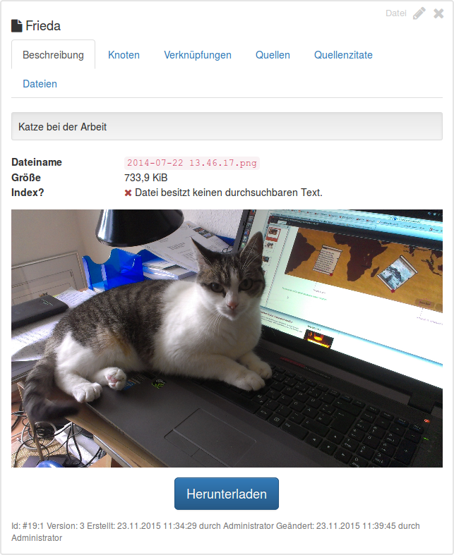
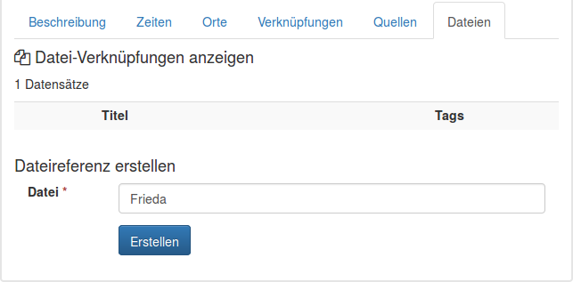
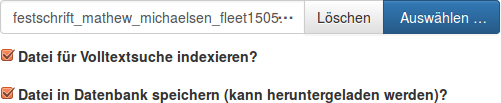
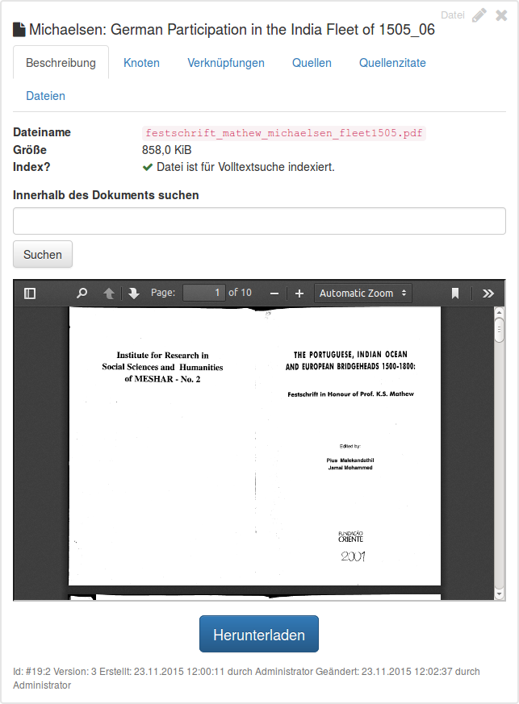
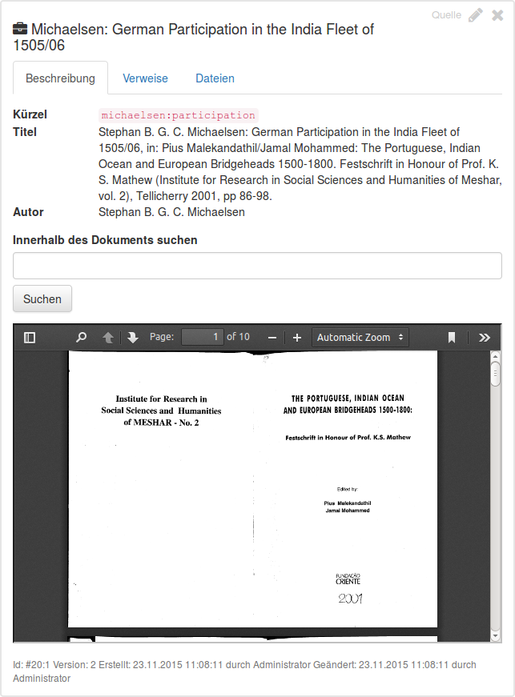

## Dateien und Quellenangaben hinzufügen

[<< Erste Schritte](run.md)

Sie haben nun ihre ersten Knoten und Verknüpfungen erstellt. Es wird Zeit, dass wir zu Dateien und Quellenangaben
kommen.

### Quellen

Wenn Sie mit Knoten und Verknüpfungen arbeiten, mag es oft nützlich sein, wenn man später weiß _wo_ man die Information
gefunden hat. Sie können Quellen und Quellenverweise zu diesem Zweck nutzen. Zunächst erstellen Sie eine Quelle &ndash;
ähnlich wie Knoten und Verweise.

Es gibt drei Pflichtfelder:

* **Voller Titel:** Gesamter Titel, d.h. volle Quellenangabe wie sie z.B. in einem Literaturverzeichnis vorkommen würde.
* **Kurztitel:** Gekürzter Titel, z.B. Autor, Haupttitel.
* **Kürzel:** Kürzel zur Verwendnung in Textfeldern. Es sollte etwas in der Art `autor:titel` sein. S. unten wie man
  Kürzel verwendet.

Nach dem Speichern kann man die neue Quelle auf zweierlei Weise nutzen:

#### Quellenverweise erstellen

Zum einen können Sie Quellverweise zu ihren Knoten, Verknüpfungen und Dateien hinzufügen. Klicken Sie auf den Reiter
"Quellen" oder "Verweise". Am Fuß des Reiters sehen Sie "Neues Quellenzitat hinzufügen".

Geben Sie den Titel, den Autoren oder das Kürzel in die Zeile "Quelle" ein und Sie erhalten eine Auswahl möglicher
Quellen. Seitenzahlen oder andere Informationen können ins Feld "Seiten/Text" eingetragen werden. Klicke Sie auf
"Erstellen" und Sie haben nun eine Quellenangabe erstellt.

#### Verweise im Text erstellen

Alternativ dazu können Sie eine Quellenangabe im Beschreibungstext erstellen. Dafür benötigen Sie das oben erstellte
Kürzel. In einem Beschreibungstext können Sie es wie folgt eintragen:

Das Kürzel wird folglich durch zwei eckige Klammern umgeben. Die Ausgabe ist dann folgende:

### Dateien hochladen

Segrada kann Dateien in der Datenbank vorhalten. Dies hat folgende Vorteile:

* Sie können diese Dateien mit ihren Knoten, Verknüpfungen und Quellen verbinden.
* Falls eine Datei ein Dokument ist, kann es im Volltext durchsucht werden. Dies betriftt beispielsweise Word-,
  Libreoffice- oder PDF-Dateien.
* Sie können Metadaten (Name, Beschreibung, usw.) zu den Dateien angeben, die dann durchsuchbar sind.

#### Bild zu einem Knoten hinzufügen

Um ein Bild für einen Knoten hochzuladen, laden Sie eine Bild-Datei hoch:

Das einzige Pflichtfeld ist die Datei selbst. Alle anderen Felder sind optional. Die Felder "Volltextsuche" und "Datei
in Datenbank speichern" werden weiter unten erklärt.

Nach dem Speichern sehen Sie die Daten wie folgt:

Lassen Sie sich nun den gewünschten Knoten anzeigen und verknüpfen Sie diesen mit der gerade hochgeladenen Datei. Dazu
können Sie den Reiter "Dateien" wählen:

#### PDF zu einer Quelle hinzufügen

Genauso lassen sich im Grunde auch Dokumente wie PDFs hinzufügen:

Hier eine kurze Erklärung zu den beiden Checkboxen:

* **Datei für Volltextsuche indexieren?** Wenn dies angehakt ist, wird Segrada versuchen, die Datei in der Volltextsuche
  zu integrieren. Das funktioniert nur bei Dokumenten wie PDFs, Word- oder Open-/LibreOffice-Dateien.
* **Datei in Datenbank speichern (kann heruntergeladen werden)?** Beim Anhaken wird die Datei tatsächlich in Segrada
  gespeichert. Wenn Sie dies nicht anhaken, werden nur die Metadaten (Dateiname, Größe, usw.) der Datei gespeichert,
  nicht die Datei selbst. Ein Volltextindex wird ggf. trotzdem erstellt.

Der Grund, eine Datei nicht in der Datenbank halten zu wollen, könnten rechtliche Nutzungseinschränkungen sein. Dann
könnte man den Volltext zwar durchsuchen, nicht aber die Datei herunterladen.

Nach dem Hochladen des PDFs sehen Sie folgende Details:

Sie können die Datei nun ihrer Quelle zuordnen.

**Anmerkung:** Das erste Dokument, das mit einer Quelle verknüpft wird, gilt das eingescanntes Original dieser Quelle
und wird in der Beschreibung dieser mit angezeigt:

[<< Erste Schritte](run.md)