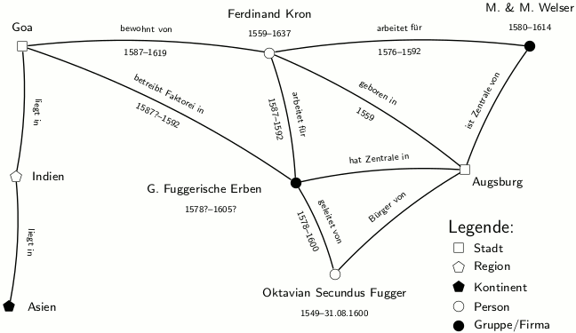

# Was ist Segrada?

Segrada ist eine semantische Graphdatenbank für Forschung, Dokumentation und private Daten. Mit ihrer Hilfe lassen
sich (fast) beliebige Informationen miteinander verknüpfen.

Beispiel eines historischen semantischen Netzwerks:

Das Bild oben zeigt einige der Möglichkeiten von Segrada auf:

* Zu sehen sind diverse **Knoten**, die durch Namen dargestellt werden. Ein solcher Knoten heißt Ferdinand Kron, eine
  Person, die von 1559 bis 1637 lebte. Segrada kann all diese Daten erfassen (und noch mehr).
* Knoten sind *semantisch* untereinander verknüpft, d.h. die **Verknüpfungen** tragen eine Bedeutung (und ebenfalls ggf.
  zeitliche Angaben), die die Art der Verbindung verdeutlicht.
* Das Bild zeigt also einen **Graphen** mit Knoten und Verknüpfungen an (bzw. mit Vertices und Kanten), die auch ein
  Mensch leicht interpretieren kann: Ferdinand Kron lebte also eine Weile in Goa und arbeite für zwei Firmen, z.T.
  zur selben Zeit. Beide Firmen stammten aus Augsburg, wie auch Kron selbst.

Mit Segrada kann man solche Graphen erstellen und sich auch anzeigen lassen. Segrada bietet darüber hinaus noch weitere
Features an:

* Tabellen- und Graphenansicht der Datenbank
* Knoten und Kanten können mit Tags (Schlagwörter), Farben und Piktogrammen (Icons) beschrieben und besser ausgezeichnet
  werden.
* Tags können hierarchisch geordnet werden, um Ontologien oder andere Ordnungssysteme definieren zu können.
* Knoten und Verknüpfungen können mit Quellenverweisen versehen werden. Dies ermöglicht z.B. das wissenschaftliche
  Arbeiten mit den Daten.
* Dateien können in die Datenbank hochgeladen und verknüpft werden.
* Der Volltext hochgeladener PDF, Word oder Open-/LibreOffice-Dateien kann in der Datenbank gespeichert werden.
* Suchmöglichkeiten: Volltextsuche (auch in Dateien) und verschiedene Filterfunktionen.
* Mehrbenutzerfähigkeit mit Gruppenrechten
* Skalierbar: Desktop-Betrieb, einzelner oder verteilte Serverumgebung
* Internationalisiert: im Moment Englisch und Deutsch

Segrada ist im Moment noch Beta. Feedback und Fehlermeldungen werden gerne angenommen.
