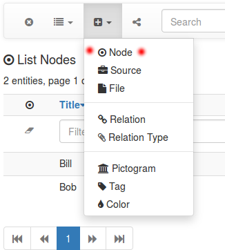
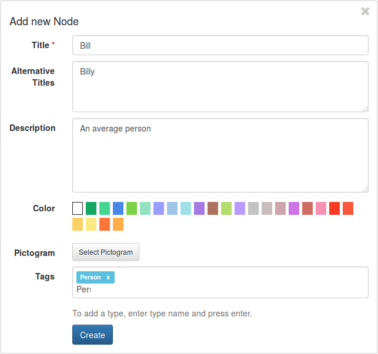
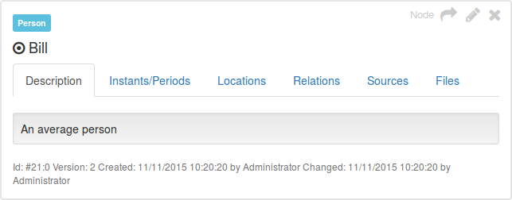
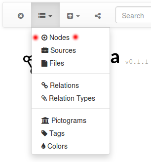
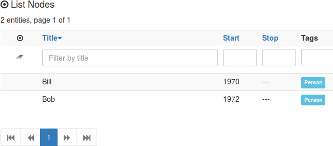
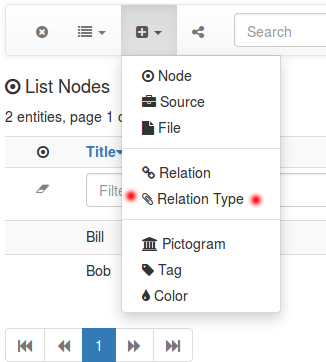
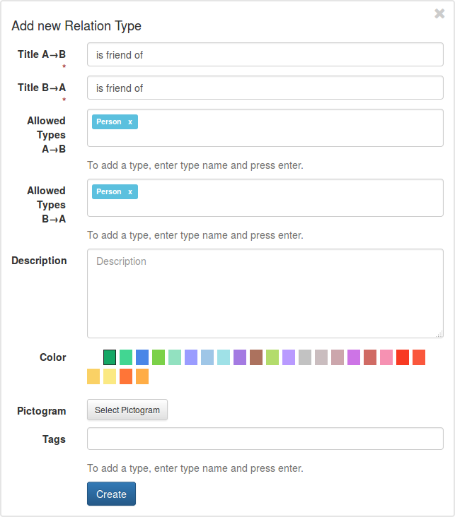
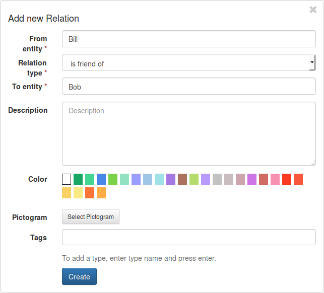
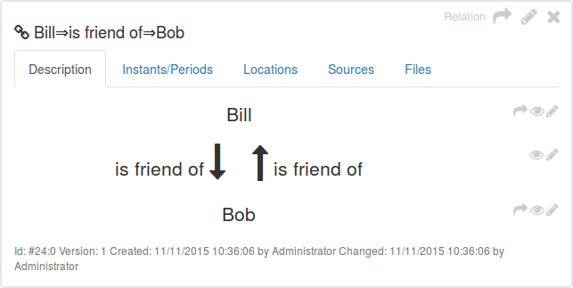
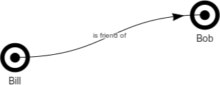

## First Steps

[<< Running Segrada](run.md)

Segrada is running &ndash; what next? This is a short tutorial to get you running.

### Creating Nodes

Let's create some information nodes first. Click on the "plus" sign in the navigation bar and select "Node".

On the left side of your screen (if you are using a screen that is wide enough), you will see a form pop up. You can
now add the desired information. Only the title is mandatory, alternative titles and description should be pretty
self-explanatory. You can also define a color for your node and a pictogram (icon). There are some predefined colors
(you can add more, if needed) and no pictograms to start with (you will have to upload them yourself).

Finally, you can add tags to your node, like "Person". Adding a new tag is easy: Just enter the desired tag name and
press the enter key.

After submitting your data you will see the detail view of the node. You can now add date and location data if needed.

Add another node called Bob and give it a person tag. You can view a list of your nodes by clicking on the list symbol
in the navigation bar and selecting "Nodes".

A list of your nodes should appear.

You can search and filter your nodes &ndash; just try it!

### Creating Relation Types

Now let's connect Bill and Bob semantically. First, you need at least one relation type. Let's add a relation type by
selecting "Relation Type" via the plus sign in the navigation.

Another form will appear in which you can add your new relation type. Since relations are bi-directional, there are two
titles, one for each direction. Your titles might be the same. You can limit the possible types to certain tags, e.g.
persons.

Now you can actually create relations.

### Creating Relations

Creating relations is relatively easy, too. Select "Relation" from the plus sign (like above). And you will see yet
another form:

Nodes can be selected by entering their names and selecting the matches via mouse click or enter key. Please also
select one relation type.

Press "Create" and you have successfully connected both nodes! You can now also add date and geographical data.

You can view the graph of both friends by clicking on the arrow sign () in the top
right corner of the detail box.

A graph will be created, similar to this one:

You have now succeeded your first steps. Have fun creating your nodes and relations.
