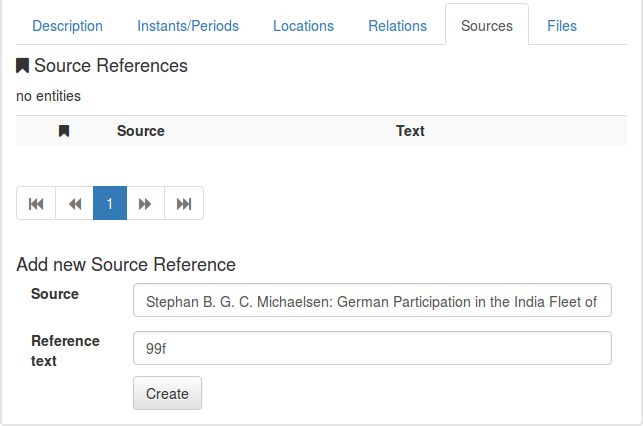
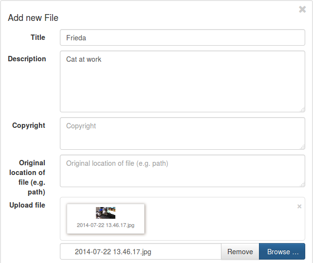
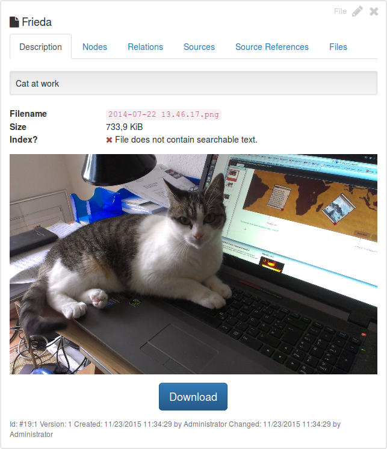
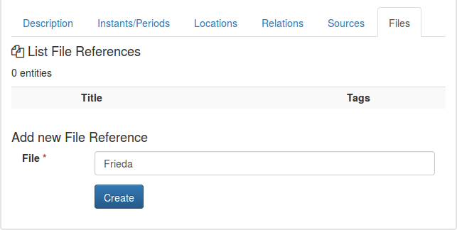
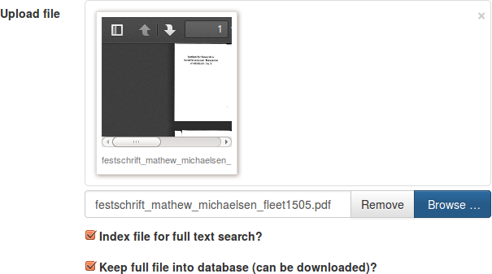
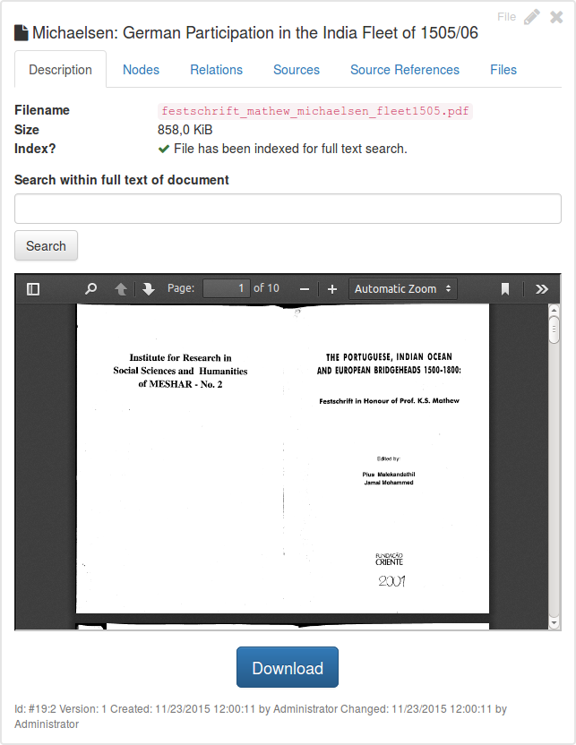
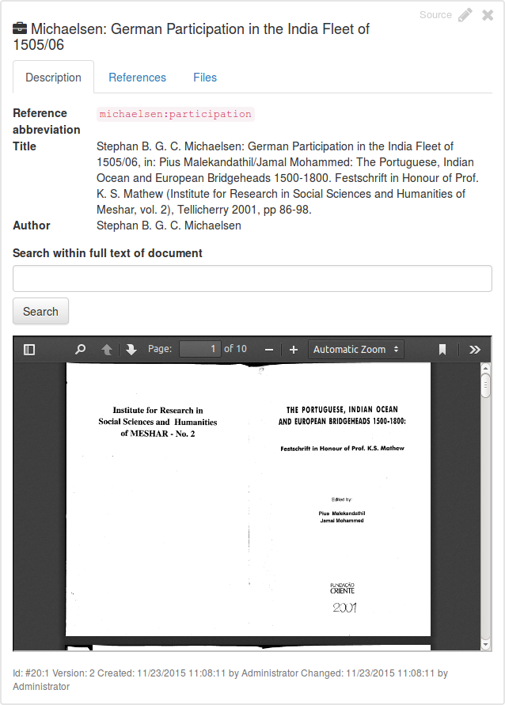

## Adding files and source references

[<< First Steps](run.md)

You have created your first nodes and relations. Now you can add files and source references.

### Sources

When you add nodes and relations, you might want to keep a reference of _where_ you found the information. You can use
sources and source references for this reason. First you need to add a source &ndash; add it like nodes and relations.

There are three mandatory fields:

* **Full title:** Whole title, e.g. full citation line of a book, paper and the like.
* **Short title:** Shortened title, e.g. just author and main title.
* **Reference abbreviation:** Should be an abbreviated title to add references in texts. Could be something like
  `author:title` for example. See below on how to use abbreviations.

After saving, you can use source references in two ways.

#### Creating Source References

First, you can add source references to your nodes, relations and files. Click on the "Sources" or "Source References"
tab. At the bottom of the tab, you will see "Add new Source reference".

Start typing the title, author or short reference name in order to get a list of possible sources to. You can add page
numbers or other information in the field "Reference text". Click on "Create" and you have successfully added a
reference!

#### Creating Text References

You can also link your source in a descriptive text. This is where you need your "Reference abbreviation" created above.
In a node description, for example, you could add the following text:

As you see, the reference abbreviation has been added embraced by two square brackets. This will render to:

### Uploading Files

Moreover, Segrada database is able to keep files. This has several advantages:

* You can link you files to nodes, relations and sources.
* If the file is a document such as a Word or LibreOffice file, or a PDF, it can be searched as full text within
  Segrada.
* You can add metadata to you file (name, desscription, copyright, etc.) by which you can find your file again.

#### Add an Image to a Node

To add a picture to a node, for example, upload an image file:

The only mandatory element is the file itself. All other fields are optional. Don't worry about the fields "Index file"
and "Keep full file" for now. These will be explained below.

You will see the data like this:

Switch to your node and add the file just uploaded. Use the tab "Files" to do this:

#### Add a PDF to a Source

Likewise, you can add documents like PDFs to the database. Let's do this now:

You might have wondered about the two checkboxes below the upload field. A short explanation:

* **Index file for full text search?** Checking this will try to create a full text of the file. This will only work on
  documents containing text such as PDFs, Word or Open-/LibreOffice files and the like.
* **Keep full file into database (can be downloaded)?** Checking this will actually allow the database to keep the file.
  If you uncheck this, the file will _not_ be keept in the database &ndash; only its meta data (filename, size, etc.)
  will be available. A full text index will still be created.
  
Not keeping the file in the database while keeping its full text index might be useful if there are certain legal
constraints on the source file for example.

After uploading the file you see a preview of your PDF.

You can now add the file to your source.

**Note:** The first document connected to a source will be considered its scanned in document and it will be shown
in the description of your source:

[<< First Steps](run.md)