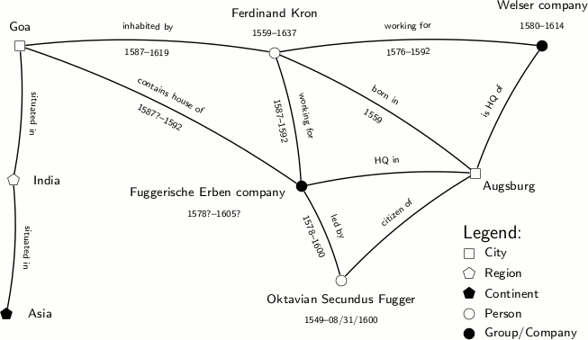

# What is Segrada?

Segrada is a semantic graph database for research, documentation, and private data aggregation. It enables you to
link (almost) all possible data into a network.

The image above convey some of the possibilities of Segrada:

* You can see a number of **nodes** annotated by names. One of those nodes is named Ferdinand Kron, for example, a
  person that lived from 1559 to 1637. Segrada can save all this data (and much more).
* Nodes are linked to each other *semantically*. Such **relations** carry a meaning (and, possibly, a time frame, too)
  which describes the type of link between the nodes.
* Thus, the image shows a **graph** with nodes and relations (or vertices and edges) which can easily be interpreted
  by humans: Ferdindand Kron in Goa for a while and worked for two companies, partially at the same time. Both firms
  hailed from the city of Augsburg, hometown of Kron.

Using Segrada you can create your own graphs and also show them in a similar way as above. Additionally, Segrada boasts
more features:

* Table and graph view of the database
* Nodes and edges can be annotated with tags, colors and pictograms (icons) to define them more thoroughly.
* Tags can be ordered hierarchically to create ontologies or other order systems.
* You can add source references to your data. This makes it possible to secure your data in a scientific way.
* Files can be uploaded to the database and linked with other data.
* Uploaded PDF, Word or Open-/LibrerOffice files can be indexed in full text.
* Search: Full text (files and other data) and a number of filter functions to find your data again.
* Multiple users and user groups
* Scalable: Use on desktop, run as single or distributed server.
* Internationalized: Currently English and German

Segrada is still beta at the moment. We are happy to receive feedback and bug reports.